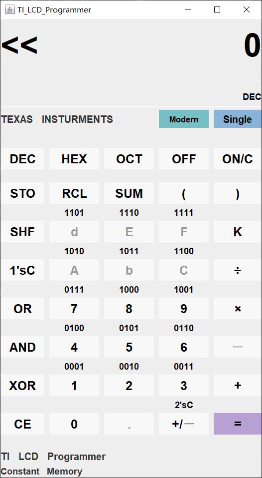
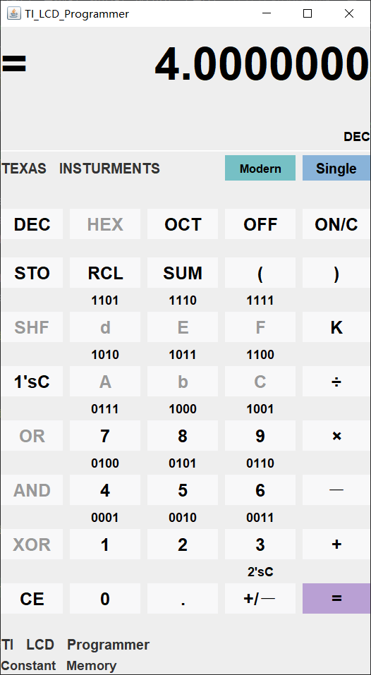

**目录**

1.  软件系统分析和设计方案。。。。。。页码

二．软件实现和代码编写。。。。。。页码

三．算法分析。。。。。。页码

四．软件调试和测试。。。。。。页码

五．课题项目工程实践总结。。。。。。页码

六．参考文献和材料。。。。。。页码

七．团队成员姓名和联系方法。。。。。。页码

八．附录。。。。。。页码

**二．软件实现和代码编写**

代码分为图形界面和功能实现两部分。我们先看图形界面部分。

**图形界面部分：**

接着来看功能实现部分

（这部分比较复杂，因为程序是一点点添加完成的，起初只实现比较简单的功能，然后不断添加，越来越复杂，如果过程看不懂，请结合算法分析的流程图理解。）

**功能实现部分**

本次大作业的基本要求只需实现10进制和16进制的基础算术运算，即不含括号的单步加减乘除运算。那我们首先实现单步加运算。

基本思路是，首先获取用户输入的操作数，然后进行运算，判断结果是否溢出并做对应的处理，最后显示答案。这里要注意，例如1+2=3。1是第一个操作数，+是操作符，2是第二个操作数，3是最后的答案。如果要实现连续运算，就必须把答案也就是answer赋给第一个操作数，这也就是最后的updateAnswer函数的作用。

在图形界面部分，我们每输入一个数字或者符号，都会通过displayIOput函数将该字符添加到临时变量tmp里，此时的displayIOput函数内容很简单，就是tmp+=新来的字符。但我们后面会进行扩充。

{width="2.252083333333333in"
height="0.7479166666666667in"}

这样就可以开始第一步了，从IOputtext里获取用户输入的数据

这里要说明一下本程序用来保存数据的数据类型是大数类型，这样可以精准计算并且计算范围大

{width="5.269444444444445in"
height="1.7215277777777778in"}

其中，first是第一个操作数，second是第二个，answer保存答案

下面，我们将获取到的操作数赋给second

{width="6.547916666666667in"
height="3.6958333333333333in"}

因为从计算器获取的是字符串而不是能直接用于计算的数据，所以我们要将字符串转换成大数类型赋值给second。这里注意我们获取后赋值的永远是第二个操作数，因为第一个操作数要留给上一次运算的答案。

有了操作数后我们就可以开始运算，这里给+号运算符设定运算类型为1，送给calculate

{width="3.252083333333333in"
height="0.9388888888888889in"}当case=1时执行加法运算。

最后更新答案保存到first，就实现了最基本的单步加法。{width="1.8347222222222221in"
height="0.35625in"}

同理，可以计算减法，乘法，和除法，运算过程是一样的。

于是calculate函数增加运算，对应的运算符号的按钮也要变化

{width="6.338888888888889in"
height="3.390972222222222in"}

写完了运算符，还要写等号，等号与运算符不一样，按下等号后显示的答案是计算上一个运算符的结果。事实上，如果1+2+3应该是3+3，也就是说按下运算符的时候也要将上一个运算符的计算结果算出来

所以实际上calculate计算的是上一个运算符的结果

最终的calculate如下，后面的5678对应and，or，xor，shf运算，他对上一个运算符进行判断，以决定是什么运算

{width="6.695833333333334in"
height="8.304166666666667in"}

而等号的核心函数如下，与运算符的差别在于第一个变成了getCurrentText

{width="2.017361111111111in"
height="1.426388888888889in"}

这就得提到计算器的另一个功能，比如，1+2按了等号之后应该显示3，但如果什么都不输入继续按等号，他应该执行最后一次运算的过程也就是+2，所以应该显示5

需要的变量如下

{width="5.6in"
height="1.1131944444444444in"}

equaltmp用来记录最后一次运算的操作数。Equaloptmp用来保存最后一次运算的操作符

{width="5.495833333333334in"
height="1.1041666666666667in"}

于是getCurrentText如下

{width="6.695833333333334in"
height="5.452083333333333in"}

第一个if用来判断上一个符号是否是等号，如果不是的话就记录上一次的符号和操作数，第二个if用来判断，如果上一个符号是等号，且没有记录过的符号，那么直接显示数据本身，如果有记录的符号，则连按等号后执行最后一次记录的运算。

综上，现在实现了基本的单步运算，并且实现了等号可以连按的功能。这时候还要考虑到如果我先按了减号发现按错了，应该是加号，那么这时候不应该运算而应该直接切换运算符。

于是最终的操作符按钮事件如下，以加号为例，添加了一个if判断，判断应该是直接切换运算符还是进行计算。

{width="6.104166666666667in"
height="5.738888888888889in"}

完成了最基础也是最核心的部分，剩下的就很简单了。

对于加减乘除and，or，xor，移位，这些操作符的逻辑都是一样的，也就是每个操作符的按钮监听事件都是这样的结构，仅仅是操作符名字不一样，在calculate里执行的操作不一样

对于加减乘除，可以直接用大数类进行运算，对于位运算。我们写了几个运算函数

{width="6.6in"
height="2.252083333333333in"}

{width="6.695833333333334in"
height="2.252083333333333in"}
{width="6.704166666666667in"
height="2.2868055555555555in"}

{width="6.695833333333334in"
height="2.95625in"}

本质是利用java的位运算符直接运算再转换回大数类。注意本计算器没有右移，所以只能左移负数来来表示右移，所以shf函数里要进行判断，如果是负数进行的是右移运算。

实现了基本的运算后，我们还要实现进制转换功能，以十进制转十六进制为例，十六转十同理，在按下进制按钮后，界面会显示为hex，输出会调用我们写的进制转换函数将结果转换为十六进制。

{width="6.530555555555556in"
height="3.35625in"}

两个转换函数如下：

{width="6.538888888888889in"
height="5.55625in"}

{width="6.278472222222222in"
height="3.5909722222222222in"}

另外要注意，这里的16转10的函数并没有调用系统有的，而是我们自己手写的，根据位数分别乘16的多少次方这样。原因是如果用系统有的Int或者Long里面的方法，很难控制范围，long太长，int又太短，在求补和进制转换的时候会出现问题，超过int的范围但是没有超过计算机最大能计算的范围。但是10转16就没有问题，因为计算器的十进制范围和int是一样的，反之则不行。

这样，单步运算和进制转换功能都已经实现了，下面实现多步混合运算，为了方便区分，我们设置了OperateMode来表示是哪个模式，0表示单步，1表示多步混合。

在多步混合模式下，不需要每个操作符运算了，按完等号后他可以一次性运算出结果。所以不管是符号还是数据按钮，现在都变成向tmp送字符，以加号为例

{width="3.217361111111111in"
height="1.5305555555555554in"}只需要向displayIOput函数送加号符号即可。

剩下的符号同理。

而等号就有了比较大的变化

{width="5.113194444444445in"
height="4.95625in"}

在混合模式下，默认是十进制输入，按下等号后从tmp获取中缀表达式infix，将其转换为后缀表达式postfix，接着利用栈对后缀表达式进行计算，最后显示结果，同理，ifelse用来判断是否是连按的等号，如果等号连按，依然能重复执行最后一次的运算。

获取中缀表达式的过程如下（详情可以看流程图）

{width="6.686805555555556in"
height="3.84375in"}

获取很简单，赋值即可，但是这里执行了一个操作，考虑到如果数字大于两位数，比如15，在转后缀表达式时由于是以字符形式入栈，程序只能认为是1和5两个字符，所以我增加了一个for循环用来在同一个数字的不同位之间加下划线以表示这是属于同一个数，比如15，获取之后就是1_5。这样就可以实现多位数的计算。

转后缀表达式用到了栈结构，这是我们数据结构课中所学过的

根据这张表可以排列运算优先级

{width="6.165277777777778in"
height="4.15625in"}

注意第一行那边是负号，与减号区分，用的是取补运算符实现{width="6.695833333333334in"
height="6.990972222222222in"}

中缀表达式转后缀表达式的过程如下，详情可以看算法流程图。

{width="6.695833333333334in"
height="8.765277777777778in"}

最后是对后缀表达式进行运算，只展开了加法的运算，其余符号同理。{width="6.2347222222222225in"
height="9.61736111111111in"}

最后还有一个函数是用来记录和运算最后一次运算以实现等号连按功能的。

{width="6.695833333333334in"
height="6.738888888888889in"}
