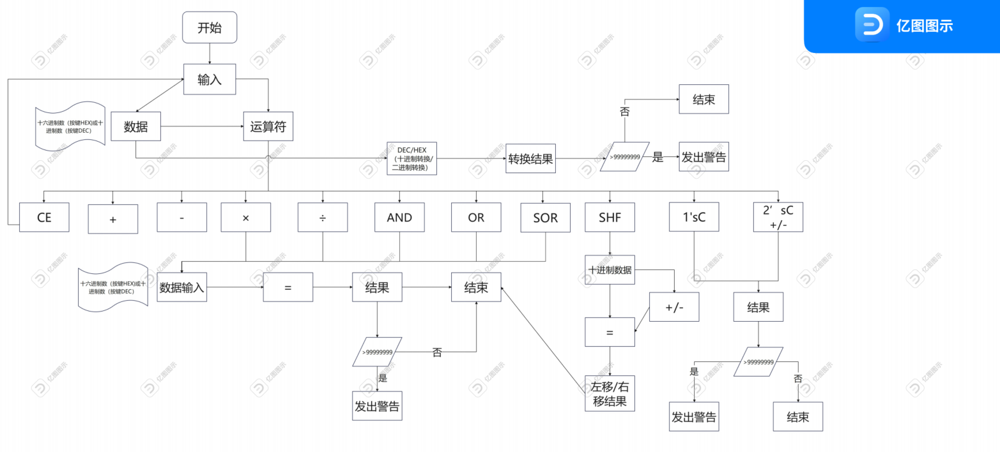
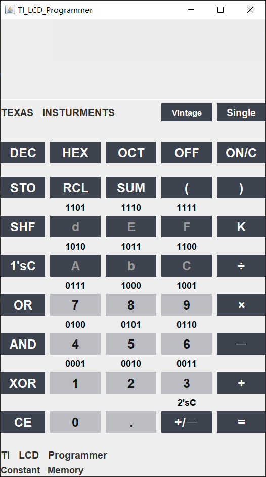
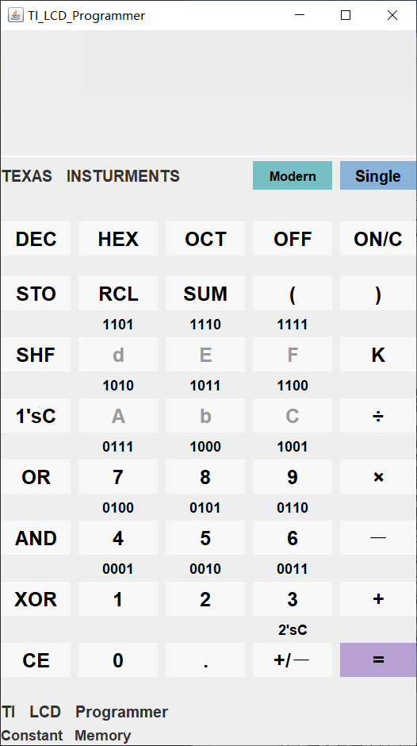
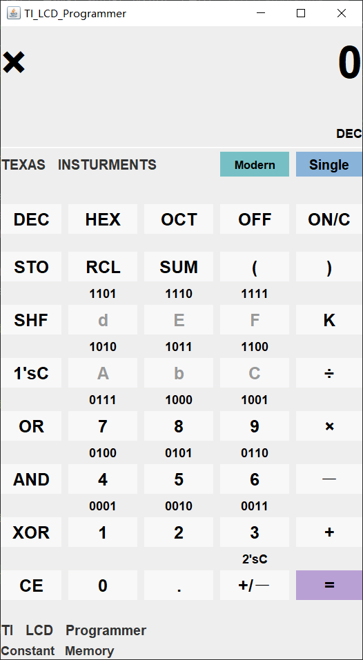
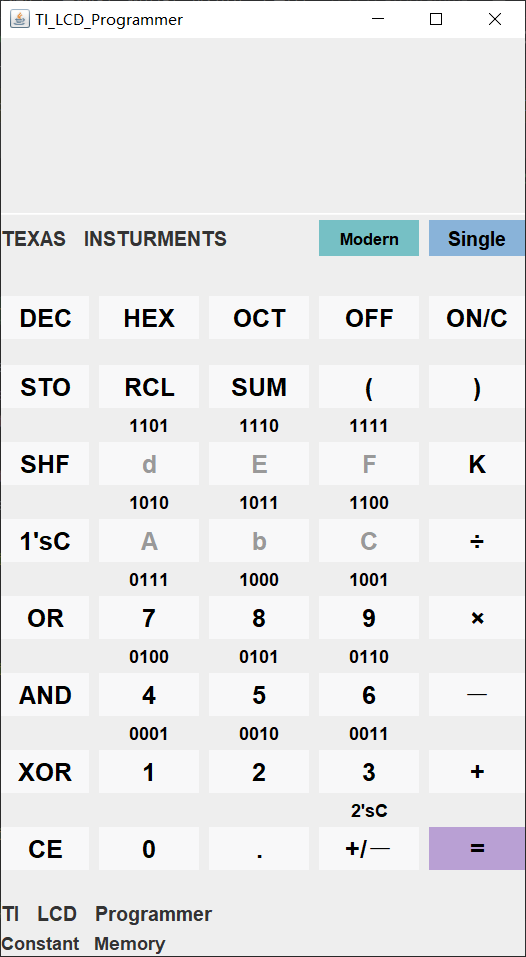
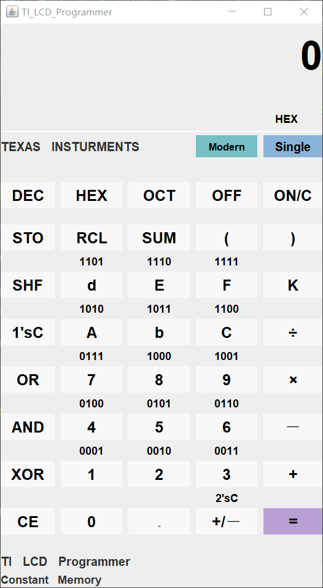
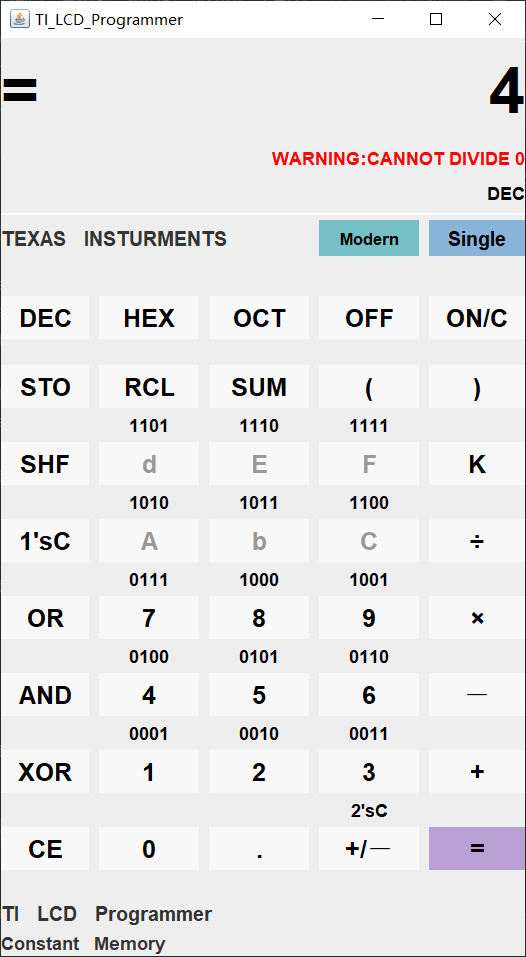
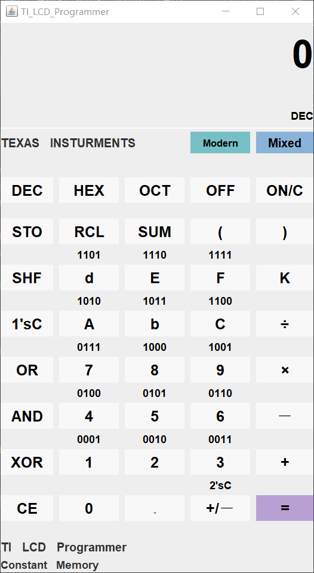
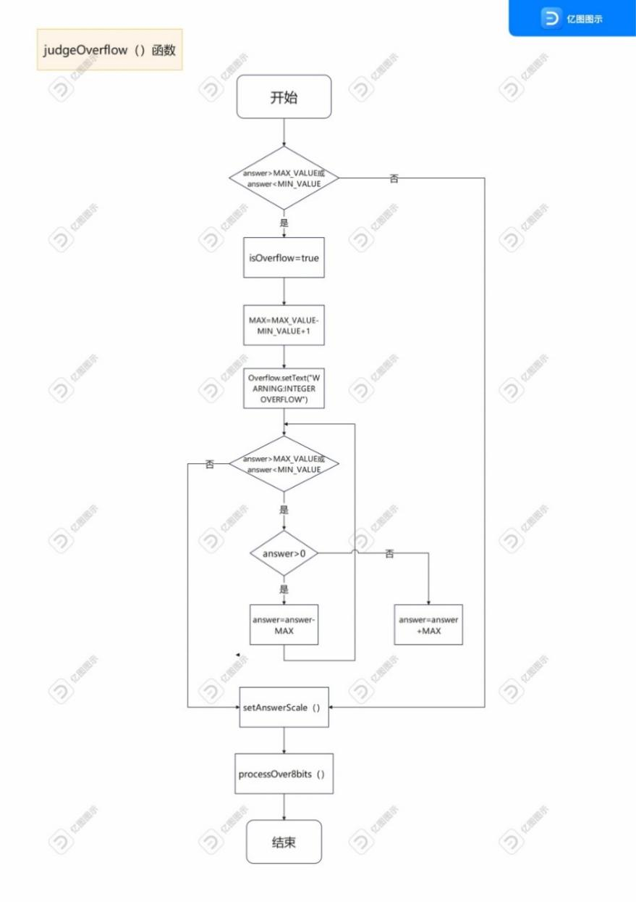

# TI_LCD_Programmer

目录

[1 软件系统分析和设计方案 [9](#软件系统分析和设计方案)](\l)

[1.1 软件系统分析 [9](#软件系统分析)](\l)

[1.1.1 系统任务概述 [9](#系统任务概述)](\l)

[1.1.2 功能需求 [9](#功能需求)](\l)

[1.1.3 软件系统流程图 [10](#软件系统流程图)](\l)

[1.2 软件设计方案 [10](#软件设计方案)](\l)

[1.2.1 软件结构设计 [10](#软件结构设计)](\l)

[1.2.2 软件功能模块详细设计 [10](#软件功能模块详细设计)](\l)

[1.2.3 软件页面详细设计 [12](#软件页面详细设计)](\l)

[1.2.4 代码结构设计 [13](#代码结构设计)](\l)

[1.2.5 软件设计的非功能性特征 [14](#软件设计的非功能性特征)](\l)

[2 软件实现和代码编写 [14](#软件实现和代码编写)](\l)

[2.1 图形界面部分 [14](#图形界面部分)](\l)

[2.2 功能实现部分： [28](#功能实现部分)](\l)

[3 算法分析 [49](#算法分析)](\l)

[3.1 单步运算算法分析 [49](#单步运算算法分析)](\l)

[3.1.1 核心函数： [49](#核心函数)](\l)

[3.1.2 核心算法流程图分析 [49](#核心算法流程图分析)](\l)

[3.2 多步运算算法分析 [51](#多步运算算法分析)](\l)

[3.2.1 核心函数 [51](#核心函数-1)](\l)

[3.2.2 核心算法分析 [52](#核心算法分析)](\l)

[3.2.3 核心算法流程图 [54](#核心算法流程图)](\l)

[4 软件调试和测试 [57](#软件调试和测试)](\l)

[4.1 软件调试 [57](#软件调试)](\l)

[4.2 软件测试 [59](#软件测试)](\l)

[4.2.1 软件的测试方案 [59](#软件的测试方案)](\l)

[4.2.2 软件的测试过程 [60](#软件的测试过程)](\l)

[5 课题项目工程实践总结 [64](#课题项目工程实践总结)](\l)

[5.1 软件工具的选择和使用方案 [64](#软件工具的选择和使用方案)](\l)

[5.2 文档工具的选择和使用方案 [65](#文档工具的选择和使用方案)](\l)

[5.3 团队协作的管理和综合问题 [66](#团队协作的管理和综合问题)](\l)

[5.4 整个开发过程中遇到的问题以及解决方法和体会
[69](#整个开发过程中遇到的问题以及解决方法和体会)](\l)

[6 参考文献和材料 [70](#参考文献和材料)](\l)

[7 团队成员姓名和联系方式 [70](#团队成员姓名和联系方式)](\l)

[8 附录 [70](#附录)](\l)

# 软件系统分析和设计方案

## 软件系统分析

上世纪70年代，当时的计算机既笨重，速度又十分缓慢。进制转换以及位运算等计算是程序员在与机器代码和内存地址打交道时经常遇到的问题，然而这在当时并没有任何易用的程序或计算设备可以解决。在1982年，德州仪器公司推出的手持计算器TI
LCDProgrammer彻底改变了当时效率低下的问题。

### 系统任务概述

我们将TI LCD
Programmer的应用对象定位在程序员，因此在进行需求分析时主要考虑进制转换和位运算等复杂运算相关的具体需求。我们知道计算器的主要功能是实现数值之间的运算，在此过程中主要涉及进制转换，四则运算，位运算和对异常的处理等。其中，进制转换主要是指十进制和十六进制之间的相互转换；四则运算主要是指该系统既可以实现单一进制模式下的带括号的组合多步运算，又可以实现混合进制模式下带括号的组合多步运算；位运算主要是指该系统能够实现与，或，异或，反码，补码和移位运算；对异常的处理主要是指对运算溢出能够发出相应警告。

### 功能需求

计算器系统的完整功能需求如下：

-   **进制转换**

该系统支持基数在十进制，十六进制之间的相互转换。由于屏幕位数的限制，其不具备将基数转换为二进制的功能。由于我们的用户大体面向程序员群体，他们需要频繁使用到机器代码和内存地址，因而不同进制之间相互转换的快速实现能很大程度上提高工作效率。

-   **四则运算**

该系统支持支持单一进制模式下（包括十进制和十六进制）的带括号的组合多步运算以及混合进制模式下带括号的组合多步运算。除了常规计算器能够实现的十进制的带括号的组合运算外，我们还提供了十六进制的带括号的组合多步运算，这能够将冗长的单步运算合并成一步，为程序员带来了极大的便利。另外，混合进制模式下的带括号的组合多步运算，成功解决了不同进制数之间先要转换成相同进制数再进行运算的繁琐操作问题，让用户能够实现输入不同进制数也能直接高效地得到运算结果。

-   **位运算**

本系统能够实现在八进制和十六进制模式下的与，或，异或，反码，补码，和移位运算。实际上，计算机内存中的所有类型的数据都以二进制格式存储。我们允许用户用十进制或十六进制来表示两个输入变量，选择运算符（按位与，按位或，异或）来计算得到所需结果。并且我们支持将输入的数据转换为反码，补码的功能。此外，该系统还支持大部分拥有进制转换功能的计算器不具备的移位功能，即右（左）移会使指定值的二进制所有位都右（左）移规定的次数。

-   **运算溢出会发出出错提示**

本系统在十六进制模式下支持最大32位有符号整数的表达，最高位是符号位，表示范围为0\~7FFFFFFF（0\~2147483647）,80000000\~FFFFFFFF（-2147483648\~-1）。我们考虑到用户会由于操作失误导致错误发生，错误主要分为两大类型。第一类是数据溢出。用户可能会输入超过允许输入范围的操作数，或者运算得到的结果超出了计算器能够正确表示的范围。另一种错误是语法错误，一些用户在输入操作数和操作符时可能会出现表达式的语法错误，这种非致命的错误，本系统不会给出错误警告，而对于一些致命的错误（会导致运算无法正确运行），计算器会给出错误提示。

### 软件系统流程图

根据功能需求的分析，我们绘制了该计算器的系统流程图如下：

{width="6.178715004374453in"
height="3.4475656167979003in"}

## 软件设计方案

### 软件结构设计

设计键盘与功能对应按钮, 见附录。键盘功能对应表。

### 软件功能模块详细设计

根据功能需求，设计对应功能。

-   启动

> 运行后，计算器属于不工作状态，对应未开电源状态；按下ON/C键，计算器开始工作。

-   风格转换

> 预计设计两种风格，一是与TI LCD
> PROGRAMMER外观相似度高的Vintage风格，二是与现代计算器风格相类似的modern风格。针对不同用户的不同喜好进行风格转换。

-   运算模式转换

> 根据题目需求需设计能够实现单步运算功能的计算器和多步运算功能的计算器。由于两种模式下进行计算的算法不同，我们决定设置运算模式转换，分别实现单步运算操作和多步运算操作，其中，不同模式下实现的功能各不相同，既有联系，又有区别。
>
> 首先，单步运算的核心是四则运算。
>
> 具体功能：实现整数和小数的加，减，乘，除，以及混合运算，需注意的是，与多步运算不同，每一步运算，顺序为优先级，加减乘除四个符号不存在优先级差异。由此，我们想到，每次运算结果都当作操作数1，用运算结果不断更新操作数1的值，再继续进行运算。
>
> 其次是多步运算。多步运算中需要实现TI LCD
> PROGRAMMER计算器中的所有功能，整数的四则运算（带优先级），位运算，数制转换，溢出判断，不仅如此，我们对功能进行升级，设计混合运算，将上述功能全部结合，四则运算，位运算，不同数制的混合运算均可实现。

-   进制转换

> 可以将输入的任意十进制整数转换为其对应的十六进制整数，将输入的任意十六进制数准换为十进制数。每一步运算结果也可以实现十进制与十六进制之间的相互转换。

-   四则运算

> 可以实现任意进制下任意整数的多步混合四则运算，以及单步运算下的任何整

数以及带小数的四则运算以及混合运算。

-   位运算

> 在十六进制模式下支持与，位或，位异或，反码，补码，移码等六种操作。十
>
> 进制中则不支持，本计算器只有左移按钮，为了实现右移，可以输入负号，相当于

"负左移"。

-   进制混合运算

> 四则运算和位运算以及十进制和十六进制下的任意整数，可以随意混合运算。
>
> 不需要保证每一步只能是十进制数或十六进制数，十进制整数和十六进制整数在任意一步计算下随时可改变。实现多种进制下的混合运算，可以按下对应进制的键，再按操作符，最后按下"="时屏幕输出十进制下的结果，若想要十六进制下的结果则可以按下HEX键。

-   其他基本功能

> 与实际计算器进行对应，CE键实现退格，ON/C开机，OFF关机，注意+/-中的"-"为变负数而"-"为减操作符。

-   显示方式

> 要求屏幕最多输出8位，支持最多使用四层括号来改变运算的顺序。

-   溢出提醒

> 若发生溢出等错误，会在屏幕上显示报错红字。

### 软件页面详细设计

为了更加贴近任务所需的TI LCD
PROGRAMMER，让我们的程序员计算器高度仿真，于是我们采用与真实计算器相近的银灰色面板，整体令人感觉高级，与真实计算器拟合度高。

计算器的上方为结果显示屏，采用灰色底纹，对应实际具有十六进制显示的液晶屏幕。计算器下方为整齐排列的40个按钮，实现具体对应的不同功能，布局整齐又简洁，按键采用深灰浅灰搭配，使不同类按键具有区分度但整体看来又十分协调。

亮点：与实际TI LCD
PROGRAMMER不同之处，市场上的计算器采用现代风格的设计方式，我们不仅设计与TI
LCD
PROGRAMMER风格还原度高的方案，我们为了贴近现代风格，还设计出现代风格的页面。同时，由于分别实现具备单步运算和多步运算功能，我们设计了切换按钮。

在显示屏右下方为风格模式转换和单/多步运算方式转换，使操作快捷，易懂又清晰。

下图为TI LCD PROGRAMMER的实际图。

{width="3.4875in"
height="4.445138888888889in"}

实际图片

{width="2.5965277777777778in"
height="4.63125in"}
{width="2.6034722222222224in"
height="4.611111111111111in"}

Vintage风格 现代风格

### 代码结构设计

代码分为图形和功能两部分。代码独立性较高，有着高可读性的同时也利于修改和复用，能根据出现的错误进行更加细化的设计。函数尽量做到了封装，只需知道输入输出以及函数的功能便可以拿给其他人用。

同时，我们的计算器继承了JFrame，可以作为窗口直接显示出来，也可以选择继承JPanel，作为自定义组件内嵌到其他界面当中。

计算器类和main分开 main函数是代码入口。

下图为UML图

{width="2.66875in"
height="1.9680555555555554in"}

{width="2.670138888888889in"
height="2.03125in"}

### 软件设计的非功能性特征

-   可扩展性：设计函数均独立，区分单步/多步运算模式，可根据扩展功能设计独立函数，可扩展性强

-   可移植性：生成jar文件，有jre即可运行

-   可重用性：可以做成组件

-   易理解性：运算函数名称代表运算功能，易于理解其实现的操作。我们的计算器附有详细的按键操作表及说明书，设计界面简洁工整，按键功能简便易于理解，没有设计第二或是第三功能键增加操作复杂度。

-   易测试性：测试按键的同时，将中间结果同步输出在控制台上。

-   可伸缩性：与真实计算器高度对应，仿真度高，存在溢出报错，规避许多未知错误。安全性：用户使用不易出错，安全性高

# 软件实现和代码编写

代码分为图形界面和功能实现两部分，接下来我们分别阐述。

## 图形界面部分

图形界面的设计使用 Swing GUI
designer来构建GUI窗体，我们仿照参考资料（引用）中的计算机真实图片尽可能地进行了还原。下图是设计图纸：

{width="1.8805741469816273in"
height="2.6587423447069116in"}

我们为此计算器设置了两套不同的样式：SkinButton（上图中名为Mordern的按钮）用于切换计算器的样式，该按钮还会同时显示现在计算的样式。

**Vintage**：当计算器样式按钮显示该单词时，表明计算器现在是复古版本，复古版本尽可能还原计算器的真实样貌。

**Modern：**当计算器样式按钮显示该单词时，表明计算器是现代版本，现代版本仿照Windows系统的设计，追求简约大方，但不失雅趣。

{width="2.0881321084864393in"
height="3.270029527559055in"}

**下面基于设计图纸，具体讲述图形化界面的实现:**

**以下是图形化界面的基本构造函数：**

```java
//构造函数 初始化布局，键盘关联和按钮
public TI_LCD_Programmer()
{
    initLayout();
    initKeyboard();
    initButton();
}
```

**(1)**   **initLayout()**

**该函数是对基本界面的设计，主要是按钮、文本、以及标签的样式的设置**

```java
private void initLayout()
{
    setToolButton();
    setDigitalButton();
    setLabel();
    setText();
}
```

*1.setToolButton*

该函数对非数字类型的按钮（不包括小数点和变换正负号的按钮）进行设置

```java
//=====================================
public void setToolButton()//非数字按钮的设置
{
    Font buttonFont = new Font("Times New Romans", Font.BOLD, 25);//设置字体
    JButton[] ToolButton = {
            DECButton, HEXButton, OCTButton, OFFButton, ONorCLRButton,
            STOButton, RCLButton, SUMButton, OPButton, CPButton, KButton, DivButton, MulButton, SubButton,
            AddButton, CEButton, EqualButton, ModeButton, a1SCButton, a2SCButton, ORButton, ANDButton, XORButton, SHFButton, SkinButton, KButton};
    for (int i = 0; i < ToolButton.length; i++)
    {
        ToolButton[i].setBorderPainted(false);//取消边框
        ToolButton[i].setFocusPainted(false);//取消聚焦
        ToolButton[i].setFont(buttonFont);
        if(!isModern) {
            ToolButton[i].setBackground(new Color(62, 68, 79));//设置背景颜色
            ToolButton[i].setForeground(new Color(255, 255, 255));//设置按钮上的字体颜色
        }
        else
        {
            ToolButton[i].setBackground(new Color(248, 248, 249));//设置背景颜色
            ToolButton[i].setForeground(Color.BLACK);//设置按钮上的字体颜色
        }
        int finalI = i;
        ToolButton[i].addMouseListener(new MouseAdapter()
        {
            @Override
            public void mouseEntered(MouseEvent e)
            {
                super.mouseEntered(e);
                if(!isModern)
                    ToolButton[finalI].setBackground(new Color(32, 38, 49));
                else
                    ToolButton[finalI].setBackground(new Color(0xD3D3D4));
            }

            @Override
            public void mouseExited(MouseEvent e)
            {
                super.mouseExited(e);
                if(!isModern)
                    ToolButton[finalI].setBackground(new Color(62, 68, 79));
                else
                    ToolButton[finalI].setBackground(new Color(248, 248, 249));
            }
        });
    }
    ModeButton.setFont(new Font("Times New Romans", Font.BOLD, 20));//设置字体);
    SkinButton.setFont(new Font("Times New Romans", Font.BOLD, 17));//设置字体);
    if(isModern)
        setUniqueModernButton();//带颜色的
    hideHEXrelatedButton();
}
```

setBackground和setForeground分别对按钮的背景颜色和字体颜色进行设置，setFont则进行字体的设置。该函数还给每个按钮添加了鼠标监听，在鼠标进入按钮时，按钮的颜色会加深，当鼠标离开时，则恢复默认颜色。这个变色的效果在之后的介绍中都简称为按钮的动态效果。

特别说明该函数中的setUniqueModernButton（），这个用于设置Modern模式下三个带颜色的按钮及其动态效果。

*2. setDigitalButton*

该函数对数字按钮进行设置，功能与上述函数没有区别。代码部分就不放了，和上述没有区别。

*3.setLabel()*

该函数对计算器上的一些标签字体进行设置（TEXAS INSTRUMENTS、TI LCD Programmer、Constant Memory、二进制数字（0001-1111）、2’sC）

```java
public void setLabel()//对标签进行设置
{
    Font putFont = new Font("Times New Romans", Font.BOLD, 65);
    Font labelFont = new Font("Times New Romans", Font.BOLD, 18);
    Font labelFont1 = new Font("Times New Romans", Font.BOLD, 20);
    Font BaseFont = new Font("Times New Romans", Font.BOLD, 18);
    JLabel[] TextLabel = {DECLabel, HEXLabel, OverFlow, OperationModeLabel};
    for (JLabel label : TextLabel)
    {
        label.setFont(BaseFont);
        label.setForeground(Color.BLACK);
        label.setBorder(BorderFactory.createEmptyBorder());
    }
    OverFlow.setForeground(Color.RED);
    OperationLabel.setFont(putFont);
    OperationLabel.setForeground(Color.BLACK);
    OperationLabel.setBorder(BorderFactory.createEmptyBorder());
    TEXAS.setFont(labelFont1);
    TI.setFont(labelFont1);
    CM.setFont(labelFont);
    JLabel[] tempLabel = {
            B0001, B0010, B0011, B0100, B0101,
            B0110, B0111, B1000, B1001, B1010,
            B1011, B1100, B1101, B1110, B1111,
            a2sC
    };
    for (JLabel jLabel : tempLabel)
    {
        jLabel.setFont(labelFont);
        jLabel.setForeground(Color.BLACK);
    }
}
```

*4.setText*

该函数主要对文本的输出进行限制，其中EmptySpacer1、EmptySpacer2以及Separator仅仅用于布局的设置，使得布局更美观。

```java
public void setText()//对文本域进行设置
{
    Font IOputFont = new Font("Times New Romans", Font.BOLD, 65);
    IOput.setFont(IOputFont);//设置字体样式
    IOput.setBackground(new Color(0xECECED));//设置背景颜色
    IOput.setForeground(Color.BLACK);
    IOput.setBorder(BorderFactory.createEmptyBorder());//文本框不带边框
    EmptySpacer1.setBorder(BorderFactory.createEmptyBorder());
    EmptySpacer2.setBorder(BorderFactory.createEmptyBorder());
    MidSpacer.setBorder(BorderFactory.createEmptyBorder());
    Separator.setForeground(new Color(0xFFFFFF));
}
```


-   **initKeyBoard()**

> 该函数实现按钮的键盘关联，下面仅给出各个按键的对应关系.

{width="4.954861111111111in"
height="4.260416666666667in"}

-   **initButton**

**该函数初始化三种类型的按钮（为他们添上监听器）**

*1.initNumberButton*

设置数字按钮的监听器：

0-9：（给出0的代码，其余相同）

```java
private void initNumberButton()
{
    a0Button.addActionListener(e -> {
        isOperator = false;
        displayIOput("0");
    });
```

16进制A-F（给出A的代码，其余相同）

```java
AButton.addActionListener(e -> {
    if (OperatingMode == 0)
    {
        if (isHEX)
        {

            isOperator = false;
            displayIOput("A");
        }
    }
    else if (OperatingMode == 1)
    {
        isOperator = false;
        displayIOput("A");
    }
});
```

小数点（dot）：

```java
        //因为一个数只能有一个小数点，如果已经输入过小数点则不能再次输入
        //并且位运算不适用于带小数点的数，所以按钮变灰
        dotButton.addActionListener(e -> {
            if (isON)
            {
                if (!isHEX && !isDotted && OperatingMode == 0)        //是十进制且没有输入过小数点
                {
                    isOperator = false;
                    displayIOput(".");
                    isDotted = true;
                    dotButton.setEnabled(false);
                    HEXButton.setEnabled(false);
//                    HEXButton.setEnabled(false);//有小数封锁HEX
                    hidedotButton();
                    hideBitoperationsButton();
                }
            }
        });
```

左右括号（混合运算模式下使用）：

```java
OPButton.addActionListener(e -> {
    if (OperatingMode != 0)
    {
        isOperator = false;
        displayIOput("(");
    }
});
CPButton.addActionListener(e -> {
    if (OperatingMode != 0)
    {
        isOperator = false;
        displayIOput(")");
    }
});
```

*2.initControlButton*

实现CE键的清除、开机功能转换以及关机：

```java
    private void initControlButton()
    {
        //开机 清零
        ONorCLRButton.addActionListener(e -> {
            isON = true;
            //开机后清零 然后显示0；
            if (!isONforCLR)
            {
                isONforCLR = true;  //转变开机键功能
                isDEC = true;
                OperatingMode = 0;//开机默认为DEC且为单步
                ModeButton.setText("Single");
                IOput.setText("0");
                OverFlow.setText("");
                DECLabel.setText("DEC");
                HEXLabel.setText("");
            }
            else
            {
                clearall();
                IOput.setText("0");
                OperationLabel.setText("");
                OverFlow.setText("");
            }
        });
        //关机
        OFFButton.addActionListener(e -> {
            isHEX = false;
            isDEC = false;
            isON = false;
            isONforCLR = false;
            //清零 然后关机
            clearall();
            OperationLabel.setText("");
            IOput.setText("");
            DECLabel.setText("");
            HEXLabel.setText("");
            OverFlow.setText("");
            hideHEXrelatedButton();
        });
        //clear error 纠错键
        //需要考虑是否删掉的是小数点
        CEButton.addActionListener(e -> {
            if (!tmp.isEmpty())
            {
                boolean flag=false;
                tmp = tmp.substring(0, tmp.length() - 1);
                for(int i=0;i<tmp.length();i++)
                    if(tmp.charAt(i)=='.')
                    {
                        flag=true;
                        break;
                    }
                if(!flag)
                {
                    isDotted = false;
                    istmpdotted=false;
                    dotButton.setEnabled(true);
                    HEXButton.setEnabled(true);
//                    HEXButton.setEnabled(true);
                    showdotButton();
                    showBitoperationButton();//位运算按钮可用
                }
                IOput.setText(tmp);
                if (tmp.isEmpty())
                    IOput.setText("0");
            }
        });
    }
```

*3.initOperatorButton*

该函数主要是操作符的设置，因为操作符和具体功能的实现息息相关，所以详情请参考功能部分。

**注意到上述函数有用到以下一些函数：**

```java
                showdotButton();
                hidedotButton();
                showBitoperationButton();
                hideBitoperationsButton();
                showHEXrelatedButton()
                hideHEXrelatedButton();
```


这些函数是功能显示函数，show/hide 表示展示和隐藏，dotButton对小数点显示进行规范，BitoperationButton是对有关位运算的按钮（SHF、AND、OR、XOR）进行规范，HEXrelatedButton是对16进制相关图形显示的规范。

这些显示函数的功能，涉及到界面动态显示的效果，对此我们不给出代码，而是对界面动态显示效果进行展示。

-   **图形化特色：界面动态显示**

在对图形化界面的设计的时候，我们考虑到了界面的动态显示，下面是主要的动态显示效果：

**单步运算模式（Single）**：

1.  按运算符会在计算器**左上角**显示当前**运算符**

-   {width="1.8236154855643045in"
    height="2.8459448818897637in"}

2.  转换进制会**显示相应的进制**（下有图片会包含该内容，故不做展示）

3.  在**关机状态**或**DEC模式**下，16进制的A-F不会进行显示，数字上的按钮将会变灰，鼠标进入按钮没有任何动态效果。

-   {width="1.8964468503937009in"
    height="2.876457786526684in"}
    {width="1.7925535870516185in"
    height="2.818144138232721in"}

4.  切换成**HEX模式**，16进制的A-F可用，按钮有正常的动态效果，而小数点按钮则会不可用，失去动态效果。这是因为16进制只支持整数。

-   {width="1.7427941819772528in"
    height="2.627232064741907in"}

5.  输入**小数点\***\*，那么**位运算**按钮和**HEX**按钮会被关闭，失去动态效果。

-   {width="1.851049868766404in"
    height="3.0456758530183725in"}

6.  进行**位运算**，那么**小数点**就会被关闭，失去动态效果。

-   {width="1.7415748031496063in"
    height="2.8286887576552933in"}

7.  **除法**，若**除数不为0**，结果一定会带**小数点**，此时**位运算、小数点、HEX**皆不可用。

-   {width="1.7595909886264216in"
    height="2.976329833770779in"}

8.  **除法**，若**被除数为整数**，且**除数不为0**，结果仍未被除数，此时HEX、dot、位运算皆可用，并显示**警告**

-   {width="1.7321511373578302in"
    height="2.659086832895888in"}

9.  如果**清零**，**DEC模式**下变成**状态1**，**HEX模式**下变成**状态2。**

10. 若**DEC模式**下运算结果的**绝对值超过99999999**，并且**没有发生溢出**，则显示警告，并自动跳转**16进制**显示。

-   {width="1.7148512685914261in"
    height="2.5639971566054243in"}

> 11\.
> 如果运算**超出计算器表示范围**，发出**警告**，用户可选择**手动消除**警告（**K键**）

-   {width="1.7138385826771654in"
    height="2.948538932633421in"}

    12.**皮肤样式**直接显示在按钮上，并随之变化

    {width="1.7226979440069992in"
    height="2.581839457567804in"}
    {width="1.7470122484689414in"
    height="2.5653510498687666in"}

    13\. **运算模式**直接显示在按钮上，并**随之变化**

    {width="1.9748064304461943in"
    height="2.7227569991251093in"}

**混合运算模式（Mixed）**

1.**小数点**不可用，其余皆可用

{width="1.9881113298337707in"
height="2.9957108486439195in"}

2.所有运算符直接**显示在输出**

{width="2.006049868766404in"
height="2.920333552055993in"}

## 功能实现部分：

本次大作业的基本要求只需实现10进制和16进制的基础算术运算，即不含括号的单步加减乘除运算。我们在做的时候，首先实现了单步加法运算，能实现加法，就能实现其他运算。

基本思路是：首先获取用户输入的操作数，接着进行运算，然后判断结果是否溢出并做对应的处理，最后显示答案。这里要**注意**，例如1+2=3。1是第一个操作数，+是操作符，2是第二个操作数，3是最后的答案。如果要实现连续运算，就必须把答案也就是answer赋给第一个操作数，这也就是最后的updateAnswer函数的作用。

核心函数如下：这五个函数分别是获取操作数，计算，处理溢出，显示答案和更新答案。

```java
getOperatorNumber();
calculate();
judgeOverflow();
displayAnswer();
updateAnswer();
```

首先来获取用户输入，在图形界面部分，我们每输入一个数字或者符号，都会通过displayIOput函数存放到tmp里。（这里只展示了该函数的部分功能）

```java
private void displayIOput(String s)
{
    if (isOperator)
        tmp = "";
    if (s.charAt(0) == '-')//负数情况
    {
        if (istmpdotted)
        {
            if (tmp.length() < 10)
                tmp = tmp + s;
        }
        else
        {
            if (tmp.length() < 9)
                tmp = tmp + s;
        }
        if (tmp.charAt(1) == '0' && tmp.length() > 2)//首位为0进行忽略
            tmp = "-" + tmp.substring(2);
        IOput.setText(tmp);
    }

}
```

字符串变量tmp保存着用户输入的字符串，我们要运算需要先将其转换成数字。这里要说明一下，本程序用来保存数据的数据类型是大数类型，这样可以精准计算结果并且大数类型的范围较大，便于对溢出进行处理。

```java
private BigDecimal first = new BigDecimal(0);
private BigDecimal second = new BigDecimal(0);
private BigDecimal answer = new BigDecimal(0);
```

其中，first是第一个操作数，second是第二个操作数，answer用来保存答案。

下面，我们将获取到的操作数赋给second，这里会进行判断，为了便于计算，我们的操作数永远储存十进制的值，所以当计算器的输入是十六进制的时候，会先调用进制转换函数再赋值。

```java
private void getOperatorNumber()           //获取当前操作数
{
    if(tmp.equals("."))
        operatorNumber = "0" + tmp;
    else
        operatorNumber = "" + tmp;
    if (!operatorNumber.isEmpty())
    {
        if (isDEC)
            second = new BigDecimal(operatorNumber);
        else if (isHEX)
            second = new BigDecimal(radix16to10(operatorNumber));
    }
    else
        second = new BigDecimal(0);
}
```

这里**注意**我们获取后赋值的永远是第二个操作数，因为第一个操作数要留给上一次运算的答案。

现在，我们有了操作数，就可以开始运算了。我们给+号运算符设定运算类型为1，接着送给calculate函数进行计算，同理我们规定，减，乘，除，与，或，异或，移位分别对应2，3，4，5，6，7，8。等号对应0。calculate函数是运算中心，如下：

```java
private void calculate()       //计算
{
    switch (lastOperator)
    {
        case 1:
            answer = first.add(second);
            break;
        case 2:
            answer = first.subtract(second);
            break;
        case 3:
            answer = first.multiply(second);
            break;
        case 4:
            if(second.compareTo(BigDecimal.valueOf(0))==0)
            {
                OverFlow.setText("WARNING:CANNOT DIVIDE 0");
                break;
            }
            else {
                OverFlow.setText("");
                answer = first.divide(second, 8, RoundingMode.HALF_UP);
            }
            break;
        case 0:
            answer = second;
            break;
        case 5:
            answer = new BigDecimal(ANDoperator());
            break;
        case 6:
            answer = new BigDecimal(ORoperator());
            break;
        case 7:
            answer = new BigDecimal(XORoperator());
            break;
        case 8:
            answer = new BigDecimal(SHFoperator());
            break;
    }
}
```

只有除法与众不同，因为除数不能为0，所以会多一步判断。

另外，**注意**到calculate的switch选择的是lastOperator，也就是上一个运算符。记录本次和上次运算符的变量如下：

```java
private int lastOperator = 0;               //上一运算符
private int nowOperator = 0;                //本次运算符
```

也就是说，我们按下操作符之后显示的答案应该是上一个运算符计算的结果。比如，1+2=，按下等号的时候应该计算+号。不仅是等号，1+2+3，按下第二个+号的时候才运算第一个加+。所以实际上calculate计算的永远是上一个运算符的结果。那么更新答案时不仅要更新first，还要更新lastOperator：

```java
private void updateAnswer()    //将结果保存到first，以便下一次运算
{
    istmpdotted=false;
    if(!isHEX) {
        dotButton.setEnabled(true);
        showdotButton();
    }
    if (tmp.length() != 0 && tmp.charAt(0) == '.')
        tmp = "0" + "";
    else
        tmp = "";
    first = answer;
    lastOperator = nowOperator;
}
```

普通运算符搞定了，还有一个特殊的符号就是等号。等号的核心函数与其他操作符有些不同

```
getCurrentText();
calculate();
judgeOverflow();
displayAnswer();
updateAnswer();
```

其中getCurrentText函数不仅调用getOperator函数获取了操作符，还会记录上一次运算的运算符和运算数以实现等号连按功能。例如，1+2按了等号之后应该结果为3，但如果什么都不输入继续按等号，计算器应执行最后一次运算的过程也就是+2，所以答案应为5，依次类推，7,9,11……。

```java
private void getCurrentText()    //记录上一次运算以便连按等号重复运算
{
    isOperator = true;
    nowOperator = 0;
    getOperatorNumber();
    if (lastOperator != 0)
    {
        equaloptmp = lastOperator;
        equaltmp = second;
    }
    if (lastOperator == 0 && equaloptmp == -1)
    {
        if (answer.compareTo(new BigDecimal(0)) != 0)
            second = answer;
    }
    else if (lastOperator == 0)
    {
        lastOperator = equaloptmp;
        second = equaltmp;
    }
}
```

其中，equaltmp用来记录最后一次运算的操作数。equaloptmp用来保存最后一次运算的操作符。函数的第一个if用来判断上一个符号是否是等号，如果不是的话就记录上一次的符号和操作数，第二个if用来判断，如果上一个符号是等号，且没有记录过操作符，那么直接显示数据本身（因为输入1=的时候没有上一个运算符，所以应该直接显示数据本身）。如果有记录的符号，则连按等号后执行最后一次记录的运算。

综上，现在实现了基本的单步运算，并且实现了等号可以连按的功能。这时候还要考虑到如果我先按了减号发现按错了，应该按的是加号，那么这时候不应该进行运算而应该直接切换运算符。于是，完成的操作符按钮监听事件如下，以加号为例，添加了一个if判断，判断应该是直接切换运算符还是进行计算。其余的运算符同理。

```java
AddButton.addActionListener(e -> {
    if (isON)
    {
        if(OverFlow.getText().equals("WARNING:CANNOT DIVIDE 0"))
            OverFlow.setText("");
        onDotandBit();
        if (OperatingMode == 0)
        {
            OperationLabel.setText("+");
            isNotEqualOperator = true;
            if (isOperator)               //如果上一个是运算符 直接切换
            {
                nowOperator = 1;
                getOperatorNumber();
            }
            else
            {
                isOperator = true;
                nowOperator = 1;
                getOperatorNumber();
                calculate();
            }
            judgeOverflow();
            displayAnswer();
            updateAnswer();

        }
    }
});
```

等号的监听事件如下：

```java
EqualButton.addActionListener(e -> {
    if (isON)
    {
        if (OperatingMode == 0)
        {

            OperationLabel.setText("=");
            isNotEqualOperator = false;
            getCurrentText();
            calculate();
            judgeOverflow();
            displayAnswer();
            updateAnswer();
        }
    }
});
```

这里再补充一下calculate对and，or，xor，shf的计算，对加减乘除可以直接用大数类型的方法，而对位运算，我们自己写了四个函数，本质是利用java的位运算符直接运算再转换回大数类。**注意**本计算器没有右移，所以只能左移负数来表示右移，所以shf函数里要进行判断，如果是负数进行的是右移运算。

```java
private int ANDoperator()
{
    if (OperatingMode == 0)
    {
        Integer int_first = Integer.parseInt(first.toString());
        Integer int_second = Integer.parseInt(second.toString());
        return int_first & int_second;
    }
    return 0;
}

private int ORoperator()
{
    if (OperatingMode == 0)
    {
        Integer int_first = Integer.parseInt(first.toString());
        Integer int_second = Integer.parseInt(second.toString());
        return int_first | int_second;
    }
    return 0;
}

private int XORoperator()
{
    if (OperatingMode == 0)
    {
        Integer int_first = Integer.parseInt(first.toString());
        Integer int_second = Integer.parseInt(second.toString());
        return int_first ^ int_second;
    }
    return 0;
}

private int SHFoperator()
{
    if (OperatingMode == 0)
    {
        Integer int_first = Integer.parseInt(first.toString());
        Integer int_second = Integer.parseInt(second.toString());
        if (int_second.compareTo(0) > 0)
            return int_first << int_second;
        else
            return int_first >> -int_second;
    }
    return 0;
}
```

实现了单步运算之后我们来实现进制转换功能，以十进制转十六进制为例，十六转十同理，在按下进制按钮后，界面会显示为hex，输出会调用我们写的进制转换函数将结果转换为十六进制。

这是hex按钮的监听事件函数：（dec按钮同理）

```java
HEXButton.addActionListener(e -> {
    if (isON)
    {
        //if(isEqualOperator==true)
        dotButton.setEnabled(false);
        showBitoperationButton();
        if (OperatingMode == 0)
        {
            if (!isHEX)
            {
                SHIFT_DECtoHEX_DISPLAY();
                IOput.setText(radix10to16(IOput.getText()));
            }
        }
    }
});
```

我们写了如下两个进制转换函数，其中，10转16的函数是调用java自带的方法，而这里的16转10的函数并没有调用系统有的，是我们自己手写的，根据位数分别乘16的多少次方。**原因是**如果用系统有的Integer或者Long里面的方法，很难控制范围，long太长，int又太短，在求补和进制转换的时候会出现问题，超过int的范围但是没有超过计算器最大能计算的范围。不过10转16就没有问题，因为计算器的十进制范围和int是一样的，反之则不行。

```java
private String radix10to16(String s)
{
    for (int i = 0; i < s.length(); i++)//转16进制去除小数点
    {
        if (s.charAt(i) == '.')
        {
            s = s.substring(0, i);
            break;
        }
    }
    if (s.length() > 0)
    {
        if(s.equals("-"))
            s="0";
        Integer temp = Integer.decode(s);
        if(!isOperator&&OperatingMode==0)
            tmp=Integer.toHexString(temp).toUpperCase(Locale.ROOT);
        return Integer.toHexString(temp).toUpperCase(Locale.ROOT);

    }
    else
        return "";
}
```

```java
private String radix16to10(String s) {
    int DECcalculate = 0;
    for (int i = 0; i < s.length(); i++) {
        int num = (int) Math.pow(16, (s.length() - 1 - i));
        switch (s.charAt(i)) {
            case '0':
                DECcalculate += 0;
                break;
            case '1':
                DECcalculate += num;
                break;
            case '2':
                DECcalculate += 2 * num;
                break;
            case '3':
                DECcalculate += 3 * num;
                break;
            case '4':
                DECcalculate += 4 * num;
                break;
            case '5':
                DECcalculate += 5 * num;
                break;
            case '6':
                DECcalculate += 6 * num;
                break;
            case '7':
                DECcalculate += 7 * num;
                break;
            case '8':
                DECcalculate += 8 * num;
                break;
            case '9':
                DECcalculate += 9 * num;
                break;
            case 'A':
                DECcalculate += 10 * num;
                break;
            case 'B':
                DECcalculate += 11 * num;
                break;
            case 'C':
                DECcalculate += 12 * num;
                break;
            case 'D':
                DECcalculate += 13 * num;
                break;
            case 'E':
                DECcalculate += 14 * num;
                break;
            case 'F':
                DECcalculate += 15 * num;
                break;
        }
    }
    if (!isOperator && OperatingMode == 0 && !isOver8bits&&!ONLYjudge)//先+后转进制条件下不可用
        tmp = "" + DECcalculate;
    return DECcalculate + "";
}
```

这样，单步运算和进制转换功能都已经实现了，下面实现多步混合运算，为了方便区分，我们设置了OperateMode来表示是哪个模式，0表示单步，1表示多步混合。

在多步混合模式下，不需要每个操作符运算了，按完等号后会一次性运算出结果。所以不管是符号还是数据按钮，现在都变成向tmp送字符，还是以加号为例，这是加号的最终版，只需要看模式为1的那部分：

```java
AddButton.addActionListener(e -> {
    if (isON)
    {
        if(OverFlow.getText().equals("WARNING:CANNOT DIVIDE 0"))
            OverFlow.setText("");
        onDotandBit();
        if (OperatingMode == 0)
        {
            ……
        }
        else if (OperatingMode == 1)
        {
            isOperator = true;
            displayIOput("+");
        }
    }
});
```

而等号就有了比较大的变化：

```java
EqualButton.addActionListener(e -> {
    if (isON)
    {
        if (OperatingMode == 0)
        {
			……
        }
        else if (OperatingMode == 1)
        {
            DECLabel.setText("DEC");
            HEXLabel.setText("");
            if (!isEqualOperator)
            {
                isEqualOperator = true;
                getInfix();
                translate();
                calculate_with_Parentheses();
                displayIOput(result.toString());
            }
            else
            {
                calculateLastResult();
                displayIOput(result.toString());
            }
        }
    }
});
```

在混合模式下，默认是十进制输入，按下等号后从tmp获取中缀表达式infix，将其转换为后缀表达式postfix，接着利用栈对后缀表达式进行计算，最后显示结果，同理，ifelse用来判断是否是连按的等号，如果等号连按，依然能重复执行最后一次的运算。如果是十六进制输入，hex按钮会向infix弹一个H用来标志这个数是十六进制，这样就完成了混合进制的带括号的运算。

获取中缀表达式的过程如下：

```java
private void getInfix()
{
    tmpfix = tmp;
    for (int i = 0; i < tmpfix.length(); i++)
    {
        if (tmpfix.charAt(i) == 'H')
        {
            i++;
            String hextmp = "";
            while (i < tmpfix.length() && ((tmpfix.charAt(i) >= '0' && tmpfix.charAt(i) <= '9') 
                                           || (tmpfix.charAt(i) >= 'A' && tmpfix.charAt(i) <= 'F')))
            {
                hextmp += tmpfix.charAt(i);
                i++;
            }
            String inttmp = radix16to10(hextmp);
            for (int j = 0; j < inttmp.length(); j++)
            {
                infix = infix + inttmp.charAt(j) + "_";
            }
            infix = infix.substring(0, infix.length() - 1);
            i--;
            continue;
        }
        if (i + 1 < tmpfix.length()
                && (tmpfix.charAt(i) >= '0' && tmpfix.charAt(i) <= '9')
                && (tmpfix.charAt(i + 1) >= '0' && tmpfix.charAt(i + 1) <= '9'))
            infix = infix + tmpfix.charAt(i) + "_";
        else
            infix = infix + tmpfix.charAt(i);
    }
}
```

获取很简单，赋值即可，但是这里执行了一个操作，**考虑到**如果数字大于两位数，比如15，在转后缀表达式时由于是以字符形式入栈，程序只能认为是1和5两个字符，所以我们增加了一个for循环用来在同一个数字的不同位之间加下划线以表示这是属于同一个数，比如15，获取之后就是1_5。这样就可以实现多位数的计算。

中缀表达式转后缀表达式用到了我们数据结构课所学的算法，利用栈的结构特性实现。首先根据运算优先级排好次序：


注意第一行这里是负号，与减号区分，用的是连字符符号实现

```java
private int priority(char op)
{
    int priority = -1;
    if (op == '\u00AD')              //这是负号不是减号 用的是输入法的连字符
        priority = 7;
    if (op == '*')
        priority = 6;
    if (op == '/')
        priority = 6;
    if (op == '+')
        priority = 5;
    if (op == '-')
        priority = 5;
    if (op == '<')
        priority = 4;
    if (op == '&')
        priority = 3;
    if (op == '^')
        priority = 2;
    if (op == '|')
        priority = 1;
    if (op == '(')
        priority = 0;

    return priority;
}
```

接着是最核心的转换函数translate：

```java
private void translate()
{
    Stack<Character> s = new Stack<>();
    for (int i = 0; i < infix.length(); i++)
    {
        if ((infix.charAt(i) <= '9' && infix.charAt(i) >= '0') || infix.charAt(i) == '_')
        {    //如果是数字，直接入栈
            postfix += infix.charAt(i);
        }
        else
        {                        //否则不是字母
            if (s.empty())            //栈空则入站
                s.push(infix.charAt(i));
            else if (infix.charAt(i) == '(')   //左括号入栈
                s.push(infix.charAt(i));
            else if (infix.charAt(i) == ')')
            {  //如果是右括号，只要栈顶不是左括号，就弹出并输出
                while (s.peek() != '(')
                {
                    postfix += s.peek();
                    s.pop();
                }
                s.pop();                 //弹出左括号，但不输出
            }
            else
            {
                while (priority(infix.charAt(i)) <= priority(s.peek()))
                { //栈顶优先级大于等于当前运算符，则输出
                    postfix += s.peek();
                    s.pop();
                    if (s.empty())      //栈为空，停止
                        break;
                }
                s.push(infix.charAt(i));   //把当前运算符入栈
            }
        }
    }
    while (!s.empty())
    {      //最后，如果栈不空，则弹出所有元素并输出
        postfix += s.peek();
        s.pop();
    }
    System.out.println(postfix);
}
```

中缀表达式转后缀表达式的规则是：从左到右遍历中缀表达式的每个数字和符号，若是数字就输出，即成为后缀表达式的一部分；若是符号，则判断其与栈顶符号的优先级，是右括号或优先级不高于栈顶符号（乘除优先加减）则栈顶元素依次出栈并输出，并将当前符号进栈，一直到最终输出后缀表达式为止。详细的可以看算法分析部分。

最后是对后缀表达式进行运算，[后缀表达式](https://so.csdn.net/so/search?q=后缀表达式&spm=1001.2101.3001.7020)的求值规则为：从左到右扫描后缀表达式，如果遇到操作数，将其压入栈中，如果遇到操作符，则从栈中弹出两个操作数，计算结果，然后把结果入栈，直到遍历完后缀表达式，则计算完成，此时的栈顶元素即为计算结果。

```java
private void calculate_with_Parentheses()
{
    Stack<BigDecimal> st = new Stack<>();
    for (int i = 0; i < postfix.length(); i++)
    {
        if (postfix.charAt(i) >= '0' && postfix.charAt(i) <= '9')
        {
            tmp_when_calculate += postfix.charAt(i);
            if (postfix.charAt(i + 1) == '_')
            {
                i++;
            }
            else
            {
                st.push(new BigDecimal(tmp_when_calculate));
                tmp_when_calculate = "";
            }
        }
        if (postfix.charAt(i) == '+')
        {
            tmp2 = st.peek();
            st.pop();
            tmp1 = st.peek();
            st.pop();
            result = tmp1.add(tmp2);
            st.push(result);
            record_last_operator = 1;
            record_last_number = tmp2;
        }
        if (postfix.charAt(i) == '-')
        {
            tmp2 = st.peek();
            st.pop();
            tmp1 = st.peek();
            st.pop();
            result = tmp1.subtract(tmp2);
            st.push(result);
            record_last_operator = 2;
            record_last_number = tmp2;
        }
        if (postfix.charAt(i) == '*')
        {
            tmp2 = st.peek();
            st.pop();
            tmp1 = st.peek();
            st.pop();
            result = tmp1.multiply(tmp2);
            st.push(result);
            record_last_operator = 3;
            record_last_number = tmp2;
        }
        if (postfix.charAt(i) == '/')
        {
            tmp2 = st.peek();
            st.pop();
            tmp1 = st.peek();
            st.pop();
            result = tmp1.divide(tmp2, 2, RoundingMode.HALF_UP);
            st.push(result);
            record_last_operator = 4;
            record_last_number = tmp2;
        }
        if (postfix.charAt(i) == '&')
        {
            tmp2 = st.peek();
            st.pop();
            tmp1 = st.peek();
            st.pop();
            result = new BigDecimal(ANDoperator());
            st.push(result);
            record_last_operator = 5;
            record_last_number = tmp2;
        }
        if (postfix.charAt(i) == '|')
        {
            tmp2 = st.peek();
            st.pop();
            tmp1 = st.peek();
            st.pop();
            result = new BigDecimal(ORoperator());
            st.push(result);
            record_last_operator = 6;
            record_last_number = tmp2;
        }
        if (postfix.charAt(i) == '^')
        {
            tmp2 = st.peek();
            st.pop();
            tmp1 = st.peek();
            st.pop();
            result = new BigDecimal(XORoperator());
            st.push(result);
            record_last_operator = 7;
            record_last_number = tmp2;
        }
        if (postfix.charAt(i) == '<')
        {
            tmp2 = st.peek();
            st.pop();
            tmp1 = st.peek();
            st.pop();
            result = new BigDecimal(SHFoperator());
            st.push(result);
            record_last_operator = 8;
            record_last_number = tmp2;
        }
        if (postfix.charAt(i) == '\u00AD')
        {
            tmp2 = st.peek();
            st.pop();
            result = tmp2.negate();
            st.push(result);
            record_last_operator = 9;
        }
    }
    result = st.peek();
    tmp = "";
}
```

另外，还有一个函数是用来记录和运算最后一次运算以实现等号连按功能的。

```java
private void calculateLastResult()       //这个是多步运算中用来计算最后一次操作的函数，以实现连按等号重复最后一次运算
{
    if (record_last_operator == 1)
        result = result.add(record_last_number);
    if (record_last_operator == 2)
        result = result.subtract(record_last_number);
    if (record_last_operator == 3)
        result = result.multiply(record_last_number);
    if (record_last_operator == 4)
        result = result.divide(record_last_number, 0, RoundingMode.HALF_UP);
    if (record_last_operator == 5)
    {
        tmp1 = result;
        tmp2 = record_last_number;
        result = new BigDecimal(ANDoperator());
    }
    if (record_last_operator == 6)
    {
        tmp1 = result;
        tmp2 = record_last_number;
        result = new BigDecimal(ORoperator());
    }
    if (record_last_operator == 7)
    {
        tmp1 = result;
        tmp2 = record_last_number;
        result = new BigDecimal(XORoperator());
    }
    if (record_last_operator == 8)
    {

        tmp1 = result;
        tmp2 = record_last_number;
        result = new BigDecimal(SHFoperator());
    }
    if (record_last_operator == 9)
    {
        result = result.negate();
    }

}
```

judgeOverflow

该函数用于判断计算结果是否溢出，由于计算的限制，十进制模式下仅支持显示±.00000001~±99999999，而16进制为带符号的32位，运算结果应该在2的-31次方到2的31次方减一之间，所以判断运算结果是否超出表示十进制表示范围以及运算中是否发生了运算溢出。

首先判断是否发生运算溢出：

```Java
private void judgeOverflow()
{
    if ((answer.compareTo(BigDecimal.valueOf(Integer.MAX_VALUE)) > 0) || (answer.compareTo(BigDecimal.valueOf(Integer.MIN_VALUE)) < 0))
    {
        isOverflow = true;
        long MAX = (long) Integer.MAX_VALUE - (long) Integer.MIN_VALUE + 1;
        OverFlow.setText("WARNING:INTEGER OVERFLOW");
        do
        {
            if (answer.compareTo(BigDecimal.valueOf(0)) > 0)
                answer = answer.subtract(BigDecimal.valueOf(MAX));
            else if (answer.compareTo(BigDecimal.valueOf(0)) < 0)
                answer = answer.add(BigDecimal.valueOf(MAX));
        } while ((answer.compareTo(BigDecimal.valueOf(Integer.MAX_VALUE)) > 0) || (answer.compareTo(BigDecimal.valueOf(Integer.MIN_VALUE)) < 0));
    }
    ......
}
```

由于大数类型表示范围十分广，远远超过32位，故判断运算溢出只需要判断结果。如果运算结果（answer）的大于32位的最大值，则对结果循环减去32位表示范围的长度，使得answer落在最大值和最小值之间，若运算结果小于32位的最小值，则对结果循环做加法，使answer落在最大值和最小值之间。

在处理完溢出以后，对answer最终保留的位数进行调整：

```java
private void setAnswerScale()//对answer位数进行限制，如果超过8位则直接保留整数部分
{
    String temp = answer.toPlainString();
    int ceil1 = Math.min((temp.length() - 1), 9);
    int ceil2 = Math.min((temp.length() - 1), 8);
    int location = 0;
    for (int i = 0; i < temp.length(); i++)
    {
        if (temp.charAt(i) == '.')
        {
            location = i;
            break;
        }
        else
            location = temp.length() - 1;
    }
    if (answer.compareTo(BigDecimal.valueOf(0)) < 0)//负数情况的判断
    {
        if (Nothasdot())
        {
            answer = answer.setScale(0, RoundingMode.HALF_UP);
        }
        else
        {
            if (9 - location < 0)
                answer = answer.setScale(0, RoundingMode.HALF_UP);
            else
            {
                if (temp.charAt(1) == '0' && (temp.length() - location - 1) >= 8)
                    answer = answer.setScale(ceil1 - location + 1, RoundingMode.HALF_UP);
                else
                    answer = answer.setScale(ceil1 - location, RoundingMode.HALF_UP);
            }
        }
    }
    else//非负数情况判断
    {
        if (Nothasdot())
        {
            answer = answer.setScale(0, RoundingMode.HALF_UP);
        }
        else
        {

            if (8 - location < 0)
                answer = answer.setScale(0, RoundingMode.HALF_UP);
            else
            {
                if (temp.charAt(0) == '0' && (temp.length() - location - 1) >= 8)
                    answer = answer.setScale(ceil2 - location + 1, RoundingMode.HALF_UP);
                else
                    answer = answer.setScale(ceil2 - location, RoundingMode.HALF_UP);
            }
        }

    }
}
```

由于负号以及小数点并不占用实际的显示，故要进行分类设置，确保最终显示的结果有效数位应该是8位。

调整完毕以后，接着判断是否超过十进制的显示位数。

```
    private void processOver8bits()
    {
        boolean answerHasdot = false;
        for (int i = 0; i < String.valueOf(answer).length(); i++)
        {
            if (String.valueOf(answer).charAt(i) == '.')
            {
                answerHasdot = true;
                break;
            }
        }
        if (!answerHasdot)
        {
            if (String.valueOf(answer).charAt(0) == '-')
            {
                if (String.valueOf(answer).length() > 9 )//&& isDEC
                {
                    isOver8bits = true;
                    if (!isOverflow&&isDEC)//Overflow优先显示
                    {
                        OverFlow.setText("WARNING:ONLY HEX");
                        HEXButton.doClick();
                    }
                }
                else
                {
                    isOver8bits = false;
//                    OverFlow.setText("");
                }
            }
            else
            {
                if (String.valueOf(answer).length() > 8 )//&& isDEC
                {
                    isOver8bits = true;
                    if (!isOverflow&&isDEC) {
                        OverFlow.setText("WARNING:ONLY HEX");
                        HEXButton.doClick();
                    }
                }
                else
                {
                    isOver8bits = false;
//                    OverFlow.setText("");
                }
            }
        }
    }
```

这里负号和小数点不算显示负号，所以要对answer进行处理，提出它实际的有效位数，如果answer确实超过了十进制的显示位数，判断是否发生溢出，如果有溢出，由于溢出的警告优先级更高，此时不显示超过显示位数的警告，但依然会将计算器切成16进制模式。如果没有发生溢出，则发出超过显示位数警告并将计算器切成16进制模式。如果answer没有超过十进制显示位数，则正常显示。

# 算法分析

## 单步运算算法分析

### 核心函数：

这五个函数分别是获取操作数，计算，处理溢出，显示答案和更新答案。

> getOperatorNumber();
>
> calculate();
>
> judgeOverflow();
>
> displayAnswer();
>
> updateAnswer();

### 核心算法流程图分析

getOperatorNumber();

{width="6.63125in"
height="2.107638888888889in"}

calculate();

{width="5.826388888888889in"
height="2.5in"}

> judgeOverflow();
>
> {width="3.9972222222222222in"
> height="5.654861111111111in"}
>
> displayAnswer();
>
> {width="4.852083333333334in"
> height="3.426388888888889in"}
>
> updateAnswer();
>
> {width="4.957638888888889in"
> height="3.5006944444444446in"}

## 多步运算算法分析

### 核心函数 

getCurrentText();

getInfix();

translate();

calculate_with_Parentheses();

calculateLsatResult();

### 核心算法分析

-   **中缀表达式转后缀表达式**

**中缀表达式**：为我们日常使用的表达式形式，但是无法用计算机实现计算

**后缀表达式**：操作符位于操作数后面，可用堆栈实现多步运算。

基于堆栈的算法：

以a+b\*c+(d\*e+f)\*g为例

-   Step
    1:从左到右扫描每一个字符，如果扫描到的字符是操作数，就直接输出这些操作数。

> {width="5.059722222222222in"
> height="1.3277777777777777in"}

-   Step2: 如果扫描到的字符是一个操作符，分3种情况:

```{=html}
<!-- -->
```
-   如果堆栈是空的，直接将操作符存储到堆栈中(push)

-   如果该操作符的优先级大于堆栈出口的操作符，就直接将操作符存储到堆栈中(push)

-   如果该操作符的优先级低于堆栈出口的操作符，就将堆栈出口的操作符导出(pop),直到该操作符的优先级大于堆栈顶端的操作符。将扫描的操作符导入到堆栈中。

> {width="4.886805555555555in"
> height="1.2826388888888889in"}
>
> {width="4.9in"
> height="1.2854166666666667in"}

-   Step3：如果遇到的操作符是左括号"（"，就直接将该操作符输出到堆栈当中。该操作符只有在遇到右括号"）"的时候移除。

> {width="4.8597222222222225in"
> height="1.2819444444444446in"}
>
> {width="4.826388888888889in"
> height="1.2729166666666667in"}
>
> {width="4.846527777777778in"
> height="1.2784722222222222in"}

-   Step4:如果扫描到的操作数是右括号"）"，将堆栈中的操作符导出(pop)到output中输出，直到遇到左括号。将堆栈中的左括号移除堆栈。继续扫描下一个操作符。

> {width="5.000694444444444in"
> height="1.31875in"}

-   Step5:如果输入的中缀表达式已经扫描完了，但是堆栈中仍然存在操作符的时候，我们应该将堆栈中的操作符导出并输入到output中。

{width="5.059722222222222in"
height="1.3347222222222221in"}

{width="5.066666666666666in"
height="1.336111111111111in"}

### 核心算法流程图

getCurrentText();

{width="5.773611111111111in"
height="4.6305555555555555in"}

translate();\\

{width="6.0055555555555555in"
height="3.6034722222222224in"}

getInfix();

{width="6.166666666666667in"
height="6.495138888888889in"}

calculate_with_Parentheses();

{width="6.268055555555556in"
height="5.061111111111111in"}

右接下图

{width="5.0625in"
height="3.8631944444444444in"}

calculateLastResult();

{width="6.394444444444445in"
height="2.4291666666666667in"}

# 软件调试和测试

## 软件调试

软件调试中遇到的问题和解决过程

**注：改动见图片右侧绿色阴影部分的代码：（左侧为修改之前的代码）**

1.  问题：初启动无法获得焦点

解决方案：在this.setVisible(true);前面增加一行代码：this.setFocusable(true);

{width="5.754861111111111in"
height="0.7701388888888889in"}

2.  ce退格还显示0

{width="5.764583333333333in"
height="0.64375in"}

3.  问题：按等号键结果变为0

{width="5.75625in"
height="0.7236111111111111in"}

4.  未开机就可以使用切换功能

{width="5.763888888888889in"
height="2.486111111111111in"}

5.  问题：多步运算模式下不能连续运算

{width="5.814583333333333in"
height="1.21875in"}

6.  优化带小数点的显示

{width="5.75625in"
height="0.7770833333333333in"}

7.问题：ha+hb=21

解决方案：ha+hb本应该显示2121，因为缺少i\--，导致出错。

8.问题:无法移动负数位

解决方案：增加if判断语句

{width="5.767361111111111in"
height="0.6951388888888889in"}

9.问题：混合运算只能计算单个数字

解决方案：下划线方法（第一张图为修改前，第二张绿色部分为修改后）

{width="5.7652777777777775in"
height="2.1125in"}

{width="5.768055555555556in"
height="1.2472222222222222in"}

10. 问题：除数可以为0

> {width="5.761111111111111in"
> height="1.1in"}

11. 问题：MIX模式中显示小数点；Single模式下按左右移动键报错

{width="5.752083333333333in"
height="0.36180555555555555in"}

12优化：运算符和进制转换可调换位置，十进制小数不再能转成16进制。

{width="5.753472222222222in"
height="0.38333333333333336in"}

## 软件测试

### 软件的测试方案

本次的测试详细内容如下：

1.  开，关机

2.  回退

3.  进制转换（数据输入+进制转换+得到结果）

4.  四则运算：

·单一进制下的带括号的组合多步运算（十进制/十六进制数据输入+带括号多步加减乘除基本运算+得到结果）

·混合进制下的带括号的组合多步运算（十进制数据输入+十六进制数据输入可附加更多数据输入+带括号多步加减乘除基本运算+得到结果）

5.  位运算

·与运算（十六进制数据输入+AND+十六进制数据输入+得到结果）

·或运算（十六进制数据输入+OR+十六进制数据输入+得到结果）

·异或运算（十六进制数据输入+XOR+十六进制数据输入+得到结果）

·与，或，异或的混合运算

·反码（十六进制数据输入+1'sC+得到结果）

·补码（十六进制数据输入+2'sC+得到结果）

·左移（十六进制数据输入+SHF+十进制数据输入+得到结果）

·右移（十六进制数据输入+SHF+十进制数据输入+\[+/-\]+得到结果）

6.  溢出判断

7.  除号为0报错

### 软件的测试过程

1.  进制转换

·十六进制转换为十进制

输入\[HEX\] 3B8 \[DEC\]:

{width="1.73125in"
height="3.0881944444444445in"}
{width="1.7666666666666666in"
height="3.1131944444444444in"}

·十进制转换为十六进制

输入\[DEC\] 12 \[HEX\]:

{width="1.6027777777777779in"
height="2.8520833333333333in"}
{width="1.6222222222222222in"
height="2.904166666666667in"}

2.  四则运算

·混合进制模式下整数的带括号的加减乘除运算

输入 \[(\] 123 \[+\] 23C \[)\] \[×\] 2 \[=\] :

{width="1.5131944444444445in"
height="2.7194444444444446in"}

·带多层括号混合运算

1+((((10-1)-1)-1)-1)-1：

{width="1.8402777777777777in"
height="3.3569444444444443in"}
{width="1.820138888888889in"
height="3.3381944444444445in"}

中缀转后缀表达式：

{width="1.8229166666666667in"
height="0.6458333333333334in"}

(3)位运算

·十六进制数与，或，异或之间的混合运算

输入5A6CEF \[AND\] \[(\] D95AC7 \[OR\] E9A \[)\] \[=\]:

{width="1.4319444444444445in"
height="2.5972222222222223in"}

中缀表达式转后缀表达式

{width="2.7395833333333335in"
height="0.65625in"}

·左移操作

将FF左移8位 输入FF \[SHF\] 8 \[=\]：

{width="1.413888888888889in"
height="2.5208333333333335in"}

·右移操作

将BC8F5DD6右移16位 输入BC8F5DD6 \[SHF\] 10 \[+/-\] \[=\]：

{width="1.461111111111111in"
height="2.6458333333333335in"}

·求反码

7FFFFF的反码 输入 7FFFFF \[1'sC\]:

{width="1.5291666666666666in"
height="2.75in"}

·求补码

7FFFFF的补码 输入7FFFFF \[+/-\] (2'sC) :

{width="1.8465277777777778in"
height="3.3125in"}

(4) 溢出警告

输入\[DEC\]99999999 \[+\] \[DEC\]99999999 \[=\] :

{width="1.9326388888888888in"
height="3.45in"}

5.  除数为0报错

    输入 1 \[/\] 0 \[=\] :

{width="1.9145833333333333in"
height="3.470833333333333in"}

# 课题项目工程实践总结

## 软件工具的选择和使用方案

-   开发平台：Windows

-   软件支持的编程语言：Java

-   软件开发工具：IntelliJ IDEA

-   使用方案：代码自动提示，重构，J2EE支持，Ant，JUit，CVS整合，代码审查，创新的GUI设计。

-   IDEA优点：

1.  智能的选取。在很多时候我们要选取某个方法，或某个循环或想一步一步从一个变量到整个类慢慢扩充着选取，IDEA就提供这种基于语法的选择，在默认设置中Ctrl+w，可以实现选取范围的不断扩充，这种方式在重构的时候尤其显得方便。

2.  丰富的导航模式。IDEA提供了丰富的导航查看模式，例如ctrl+e显示最近打开过的文件，ctrl+n显示你希望显示的类名查找框(该框同样有智能补充功能，当你输入字母后IDEA将显示所有候选类名)。在最基本的project试图中，你还可以选择多种的试图方式。

3.  历史记录功能。不用通过版本管理服务器，单纯的IDEA就可以查看任何工程中文件的历史记录，但版本恢复时你可以很容易的将其恢复。

4.  对重构的优越支持。IDEA是所有IDE中最早支持重构的，其优秀的重构能力一直是其主要卖点之一。

5.  编码辅助。java规范中提倡的tostring(),hashcode(),equals(),以及所有的get/set方法，你可以不用进行任何的输入就可以实现代码的自动生成，从而把你从无聊的基本方法编码中解放出来。

6.  灵活的排版功能。基本所有的IDE都有重排版功能，但仅有IDEA的是人性的，因为她支持排版模式的定制，你可以根据不同的项目要求采用不同的排版方式。

7.  简洁易用的GUI界面。

8.  与文件系统自动同步。当你最小化IDEA，直接对文件进行编辑之后，重新打开IDEA后IDEA将自动的完成文件的更新，而不用重新导入工程或刷新工程。

9.  自定义的快捷键。强大的快捷键设置，基本可以让程序员离开鼠标工作。

10. 动态语法检测。任何不符合java规范，自己预定义的规范，累赘都将在页面中加亮显示。

11. 代码检查。对代码进行自动分析，检测不符合规范的，，存在风险的代码，并加亮显示。

12. 智能编辑。代码输入过程中，自动补充方法或类。

13. 智能模板。预置模板可以让你把经常用到的方法编辑进模板，使用时你只用输入简单的几个字母就可以完成全部代码的编写。例如使用比较高的public
    static void main(String\[\]
    args){}你可以在模板中预设pm为该方法，输入时你只要输入pm再按代码辅助键，IDEA将完成代码的自动输入。

14. 完美的自动代码完成。智能检查类中方法，当发现方法名只有一个时自动完成代码输入，从而减少剩下代码的编写工作。

15. 不使用代码检查。自动检查代码中不使用的代码，并给出提示，从而使代码更高效。

16. 智能代码。自动检查代码，发现与预置规范有出入的代码给出提示，若程序员同意修改自动完成修改。例如代码：String
    str = \"Hello Intellij \" + \"IDEA\";
    IDEA将给出优化提示，若程序员同意修改IDEA将自动将代码修改为：String
    str = \"Hello Intellij IDEA\";

17. 正则表达的查找和替换功能。查找替代支持正则表达，从而提高效率。

18. JavaDoc预览支持。支持JavaDoc的预览功能，在JavaDoc代码中ctrl+q显示JavaDoc的结果，从而提高doc文档的质量。

19. 程序员意图支持。当程序员编码时IDEA时时检测你的意图，或提供建议，或直接帮你完成代码

## 文档工具的选择和使用方案

**文档工具：**Microsoft Office 2019，Typora，pandoc

Typora 是一款由 Abner Lee 开发的轻量级 Markdown 编辑器，与其他 Markdown
编辑器不同的是，Typora
没有采用源代码和预览双栏显示的方式，而是采用所见即所得的编辑方式，实现了即时预览的功能，但也可切换至源代码编辑模式。

**使用方案：**因为本次报告涉及代码的插入，所以我们想到先使用markdown文件写报告，再利用pandoc将markdown文件转换成docx文件，这样代码排版会美观一些。

同时，本报告的markdown版本可以直接在仓库{width="0.20833333333333334in"
height="0.15625in"}https://github.com/Potatonupt/TI_LCD_Programmer.git预览，markdown版本有对代码块的标记，对代码的显示要优于word版本。

## 团队协作的管理和综合问题

团队协作的管理方法：Git

关于Git：Git是一套开源版本控制系统，能够帮助开发者在确定最终版本之前定期修改代码，从而获得理想的运行效果；这套版本控制系统能够保存每一项更改，允许多人参与协作并提供更改和贡献；所有代码副本都可以随时查看；另外，Git亦可同步团队编码工作，且妥善管理文件内容冲突。因而，Git对我们的项目开发工作的帮助是极大的。

{width="5.03369750656168in"
height="3.229574584426947in"}

我们在JAVA项目里使用git进行团队开发协作,可以非常好地管理哪些是正在开发的代码，哪些是提交测试的代码，哪些是不完善还需改进的代码。

Git优点：

可以有效避免代码冲突，每次提交均有记录，并附有注释，团队中的不同成员可以及时看到每个成员做出的修改。

对于修改记录有明确标志，方便快捷的定位到被修改的代码部分，新旧版本进行比较，可读性增强，如图所示：

{width="5.978472222222222in"
height="3.2875in"}

{width="5.870833333333334in"
height="3.2284722222222224in"}

{width="5.909027777777778in"
height="3.25in"}

新旧版本对比，让程序员一目了然，十分快捷方便。

蓝色代表修改，绿色代表新增，灰色代表删除。

由于git可以保存每次的版本变化，当新版本出现问题时，可以回退到原来版本，这个功能十分强大，在很大程度上解决了代码冲突产生的不可预知错误。

提交记录，一共交了一百多次修改，从最开始的空壳一点点添加成型。

{width="5.194775809273841in"
height="3.587308617672791in"}

协同操作：

{width="5.601437007874016in"
height="5.523863735783027in"}

## 整个开发过程中遇到的问题以及解决方法和体会

（1）遇到的问题和解决方法

-   在开发的初始阶段，我们对Git并不是很熟悉，我们通过开腾讯会议集中讨论研究，大家更加熟练运用Git进行团队协作。

-   在整个开发过程中，我们在编写代码时遇到了一些bug，例如按等号键结果变为0，多步运算模式下不能不能连续运算，混合运算只能计算单个数字等，我们通过上网百度，查阅技术论坛，开腾讯会议集中讨论等，了解出现bug的原因再通过调试修改代码，逐步优化完善，将程序的小漏洞一步步填补。

2.  体会

-   新需求应该先思考再编写代码，不然在编写代码的过程中可能会出现很多小bug，这时候再去一个个找错调试会很浪费时间，导致效率不高；

-   程序注释是很重要的，程序注释往往体现出程序员良好的编程风格。在项目的开发过程中，必要的注释也是团队合作精神的体现，是对团队成员的负责。

-   通过这次软件开发，我们意识到软件开发中的最难问题不是技术瓶颈，而是所开发的应用程序是否有价值。价值包括两方面：第一方面是从视觉角度说叫看着舒服，意思是说界面的颜色搭配是否美观，界面的元素布局是否合理，让用户一看就感觉特舒服；第二方面从感官角度说叫用着方便，意思是说该软件（或应用程序）的功能是否真的能够帮助用户解决实际问题，提高工作效率以及和用户交互是否友好。尤其是第二个方面，它就是软件的灵魂，它也是软件（或应用程序）得以永生的必要条件。

-   软件研发过程中，工作内容文档化是非常重要的，主要有几个方面：1.在写文档的过程中，我们要思考并组织语言，这样不仅能加深对知识的理解，同时记忆也变得深刻。2.无论技术知识或是业务技能形成文档后，团队成员之间能做到很好的工作交接，更快熟悉工作内容。

-   通过这次大作业，我们体验到了工程实际的开发与团队协作，学习到了git实现团队协作，markdown的用法，加深了对java的理解，不仅如此，对于文档的编写也有了更深的理解。总体来说，我们团队交流及时，配合默契，时常讨论，互相帮助

# 参考文献和材料

\[1\] TILCDPRG.PDF

\[2\]https://blog.csdn.net/qianyayun19921028/article/details/89228263

# 团队成员姓名和联系方式

----------------------------------- -----------------------------------
  成员姓名                            联系方式

​                                      

​                                      

​                                      

​                                      


----------------------------------- -----------------------------------

# 附录

\[1\]本报告的markdown版本可以直接在仓库{width="0.20833333333333334in"
height="0.15625in"}https://github.com/Potatonupt/TI_LCD_Programmer.git预览

\[2\]键盘功能对应表

{width="5.929166666666666in"
height="5.097916666666666in"}
